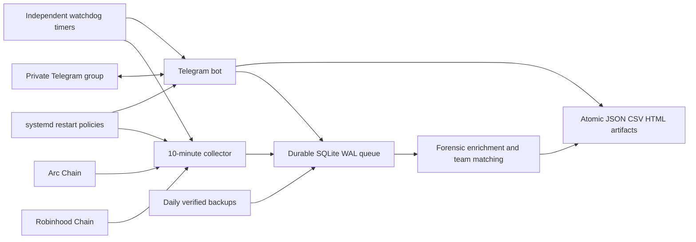

# Pure Vultr + Telegram deployment

This is the primary Phase 1 architecture. Phase 1 collects forensic evidence every 10 minutes, enriches it durably, and identifies likely developer teams. It is intentionally not a real-time sniper. Phase 2 can later enable anticipatory alerts with `TELEGRAM_PUSH_ALERTS=true` after the Phase 1 fingerprints are validated.



## Why 10 minutes

Ten minutes is the safer default for Phase 1 because enrichment can involve several RPC and explorer calls per contract. Each run handles up to 25 queued jobs; unfinished or transiently failed jobs stay in SQLite and retry later with backoff. This improves completeness without creating overlapping collectors. A process lock prevents duplicate workers.

## Telegram commands

- `/leads`: top five Phase 1 candidates, score, sibling, inferred team, wallets, and chain links.
- `/dashboard`: rebuilds and uploads the self-contained `index.html`.
- `/dbxlsx`: creates a typed, filterable workbook. HIGH_LEAD rows are green and rug rows are red.
- `/dbcsv`: uploads the raw candidate CSV.
- `/status`: queue counts, latest run, database size, chains, cadence, and whether Phase 2 pushes are enabled.

Only exact chat IDs in `TELEGRAM_ALLOWED_CHAT_IDS` are accepted. Existing leads are baselined once, preventing an alert storm. Telegram update offsets and sent-alert keys are durable. Commands fail safely without stopping the bot.

## Install

1. Create a bot with BotFather, add it to the private group, and obtain the numeric group chat ID.
2. Clone the repository to `/opt/omnireborn` on Ubuntu.
3. Run:

```bash
cd /opt/omnireborn
sudo bash deploy/install_vultr_backend.sh
```

The first run creates `/etc/omnireborn.env` and stops. Edit it and replace:

- both private/archive-capable RPC URLs;
- explorer API keys where available;
- `TELEGRAM_BOT_TOKEN`;
- `TELEGRAM_ALLOWED_CHAT_IDS`.

Keep `TELEGRAM_PUSH_ALERTS=false` for Phase 1, then rerun the installer.

No inbound web port is required. Allow SSH inbound and HTTPS/DNS outbound. The bot uses Telegram long polling.

## Operations

```bash
systemctl status omnireborn.service omnireborn-telegram.service
journalctl -u omnireborn.service -u omnireborn-telegram.service -f
systemctl list-timers 'omnireborn*'
sudo -u omnireborn /bin/bash -c 'set -a; source /etc/omnireborn.env; set +a; /opt/omnireborn/.venv/bin/python /opt/omnireborn/streamer.py --status'
```

Both services use restart policies. Watchdogs independently restart stale processes, the queue survives crashes, outputs use atomic replacement, and verified backups run daily. The installer runs collector preflight and Telegram credential/chat checks before enabling services.

## Phase 2 boundary

Do not enable push alerts merely because a candidate exceeds 65%. First validate the Phase 1 clusters, false-positive rate, funder reuse, template reuse, and behavioral habits. Phase 2 should consume those approved identities and monitor/anticipate new deployments. When ready, set `TELEGRAM_PUSH_ALERTS=true`; deduplication prevents repeats.
